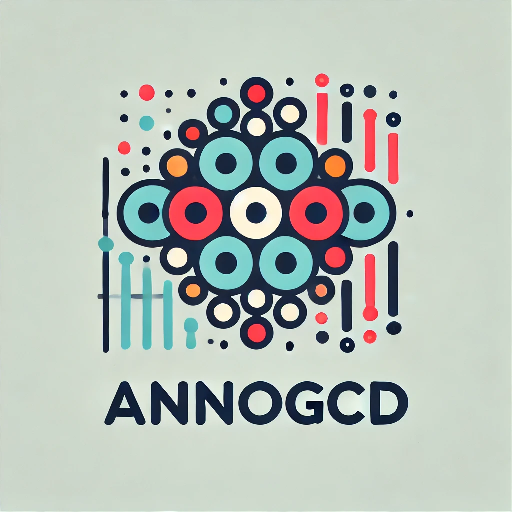

# AnnoGCD: A Generalized Category Discovery framework for automatic cell type annotation

<p align="left">
  

## Abstract

The identification of cell types in single-cell RNA sequencing (scRNA-seq) data is a critical task in understanding complex biological systems. Traditional supervised machine learning methods rely on large, well-labeled datasets, which are often impractical to obtain in open-world scenarios due to budget constraints and incomplete information. To address these challenges, we propose a novel computational framework, named AnnoGCD, leveraging Generalized Category Discovery (GCD) and Anomaly Detection (AD) for automatic cell type annotation. Our semi-supervised method combines labeled and unlabeled data to accurately classify known cell types and to discover novel ones, even in imbalanced datasets. AnnoGCD includes a semi-supervised block to first classify known cell types, followed by an unsupervised block aimed at identifying and clustering novel cell types. We evaluated our approach on five human scRNA-seq datasets and a mouse model atlas, demonstrating superior performance in both known and novel cell type identification compared to existing methods. Our model also exhibited robustness in datasets with significant class imbalance. The results suggest that AnnoGCD is a powerful tool for the automatic annotation of cell types in scRNA-seq data, providing a scalable solution for biological research and clinical applications.

## Introduction
When applied to the open-world, machine learning methods inevitably encounter both known and novel classes. Supervised approaches have received widespread attention and they rapidly progressed through the collection of large labeled datasets. These approaches normally assume that (i) the class distributions remain unchanged during the training and testing phase, and that (ii) all classes are known in advance and have some labeled examples. Both these assumptions are unrealistic for open-world contexts, where the labeling or collection of large numbers of samples might be difficult due to factors such as budget constraints or lack of comprehensive information.

Novel Class Discovery (NCD) aims to identify clusters of unlabeled instances using a similar but disjoint set of labeled samples, as proposed in several works. However, NCD assumes that all the unlabeled samples belong to novel classes during the testing phase, thus disallowing the re-discovery of known classes in open-world settings. More recently, Generalized Category Discovery (GCD) extended NCD to further recognize the known classes in the unlabeled set. Unfortunately, most of the GCD community has focused almost exclusively on computer vision problems, leaving open the question of how to apply these frameworks to tabular data where it is not possible to take advantage of powerful computer vision techniques such as convolutions, Vision Transformers, or image augmentations. Furthermore, the easy access to a large body of image data allows most GCD frameworks to deal with well-balanced datasets, and to fully exploit the power of transfer learning. Unfortunately, imbalanced datasets are particularly common in real world scenarios, especially when dealing with biological data.

Along with GCD, Anomaly Detection (AD) has numerous real-world applications, including fraud detection, network security, and health monitoring, where detecting anomalous behavior is crucial for ensuring system integrity and reliability. AD methods encompass a wide range of techniques, such as statistical approaches, clustering algorithms, and deep learning models, each tailored to different data characteristics and application scenarios. An important setting for AD is when only labeled normal samples exist, for which one class classifiers (OCCs) are popular approaches. Compared to traditional binary or multi-class classification, OCCs are useful for addressing issues related to severely imbalanced datasets.

Cell type identification with statistical and machine learning methods has emerged as a promising approach in deciphering complex biological systems. Exploiting high-dimensional single-cell data, such as single-cell RNA sequencing (scRNA-seq), supervised machine learning algorithms have been used to classify cell types based on their transcriptional profiles. Various methods, from logistic regression to Convolutional Neural Networks (CNNs), have been successfully applied for cell type classification tasks. These techniques enable the extraction of intricate patterns from scRNA-seq data, facilitating the discrimination of different cell types with high accuracy. Despite their promising results, popular computational pipelines are either based on reference transcriptomic datasets or require fully supervised training. Consequently, their performance is highly dependent on the prior information selected or on the quality of the manually annotated labels.

Motivated by common real-world scenarios and by the need to improve annotation of cell types in scRNA-seq, we developed a computational method, named AnnoGCD, building on ideas from Generalized Category Discovery and Anomaly Detection. We propose a simple, albeit efficient, semi-supervised computational pipeline that yields strong and robust performance for the identification of novel cell types, even with imbalanced datasets and for rarely occurring cell types. AnnoGCD is computationally efficient and only requires partially labeled data to correctly classify samples in known classes and automatically discover novel cell types.

## Features

- **Semi-supervised Learning**: Combines labeled and unlabeled data to classify known cell types.
- **Unsupervised Learning**: Identifies and clusters novel cell types from unlabeled data.
- **Robust to Imbalanced Datasets**: Performs well even when the dataset has significant class imbalance.

## Installation

To install the necessary dependencies, clone the repository and run:
```bash
git clone https://github.com/cecca46/AnnoGCD.git
cd AnnoGCD
pip install -r requirements.txt
```


## Data and Functions

Pre-processed publically available data for the human single cell benchmarking is available at ZENODO: https://doi.org/10.5281/zenodo.6348128
- **BM-CITE**: Human bone marrow mononuclear cells.
- **LUNG-CITE**: Human peripheral blood mononuclear cells from lung.
- **PBMC-Multiome**: Human peripheral blood mononuclear cells.
- **PBMC-TEA**: Human PBMC cells measured with the TEA-seq protocol.
- **PBMC-DOGMA**: Human PBMCs measured with the DOGMA-seq protocol.

The `FUNCTIONS.md` contains a description of the methods used in this repository.


## Project Structure

- **`NCD/main.py`**: The entry point of the project. This script handles the training and evaluation of semi and unsupervised block.
- **`NCD/model.py`**: Contains the implementation of the GNN model, including the Encoder, Discriminator, and the overall DGI model architecture.
- **`NCD/train_utils.py`**: Includes utility functions for training the model, such as accuracy computation and loss functions.
- **`NCD/utils.py`**: Provides additional utility functions such as data preprocessing, clustering accuracy calculation, and graph adjacency matrix construction.

## Notebook and example

A python notebook is provided in `NCD/notebook/NCD.ipynb` to reproduce the results and figures in the paper. Simply change the data directory to the preferred dataset you wish to analyse. 


## Conclusion

In this study, we introduced a novel computational framework, named AnnoGCD, that effectively combines semi-supervised learning with unsupervised methods to tackle the limitations of traditional supervised settings in open-world scenarios, particularly for automatic cell type annotation from single-cell RNA sequencing (scRNA-seq) data. AnnoGCD builds on Generalized Category Discovery (GCD) and Anomaly Detection (AD) to address the challenges posed by the need for extensive labeled datasets and the presence of novel cell types in biological research. Our framework is designed to handle the realistic constraints of limited labeled data, budget limitations, and incomplete information, which are common in practical applications. In detail, AnnoGCD uses a semi-supervised block to classify known cell types, followed by an unsupervised block designed to identify and cluster novel cell types. The efficacy of AnnoGCD was validated using five public scRNA-seq datasets, showing superior performance in both known and novel cell type identification compared to existing methods. The proposed pipeline demonstrated robustness in datasets characterized by significant class imbalance, a common issue in real-world biological data. This robustness is critical for ensuring the reliable identification of rare or underrepresented cell types, which are often pivotal in understanding disease mechanisms and therapeutic targets. We showed that AnnoGCD was able to learn meaningful representations of cell types and that it allowed to automatically decipher cell type annotations for unknown clusters of cells. Beyond its application to single-cell RNA sequencing data, AnnoGCD holds significant potential for use in other domains that require the classification of known categories and the discovery of novel ones from complex, high-dimensional data. 


