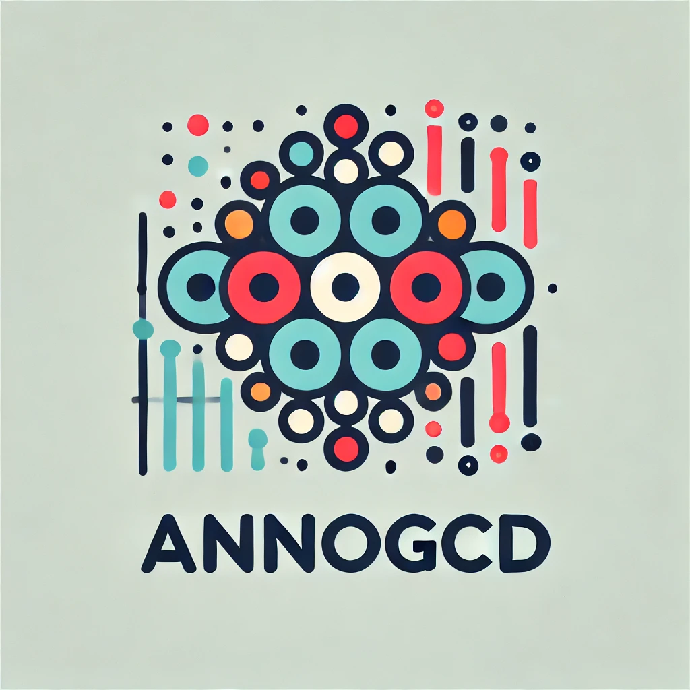

# AnnoGCD: A Generalized Category Discovery framework for automatic cell type annotation

<p align="left">
  

The identification of cell types in single-cell RNA sequencing (scRNA-seq) data is a critical task in understanding complex biological systems. Traditional supervised machine learning methods rely on large, well-labeled datasets, which are often impractical to obtain in open-world scenarios due to budget constraints and incomplete information. To address these challenges, we propose a novel computational framework, named AnnoGCD, leveraging Generalized Category Discovery (GCD) and Anomaly Detection (AD) for automatic cell type annotation. Our semi-supervised method combines labeled and unlabeled data to accurately classify known cell types and to discover novel ones, even in imbalanced datasets. AnnoGCD includes a semi-supervised block to first classify known cell types, followed by an unsupervised block aimed at identifying and clustering novel cell types. We evaluated our approach on five human scRNA-seq datasets and a mouse model atlas, demonstrating superior performance in both known and novel cell type identification compared to existing methods. Our model also exhibited robustness in datasets with significant class imbalance. The results suggest that AnnoGCD is a powerful tool for the automatic annotation of cell types in scRNA-seq data, providing a scalable solution for biological research and clinical applications.

## Features

- **Semi-supervised Learning**: Combines labeled and unlabeled data to classify known cell types.
- **Unsupervised Learning**: Identifies and clusters novel cell types from unlabeled data.
- **Robust to Imbalanced Datasets**: Performs well even when the dataset has significant class imbalance.

## Installation

To install the necessary dependencies, clone the repository and run:
```bash
git clone https://github.com/cecca46/AnnoGCD.git
cd NCD
pip install -r requirements.txt


## Data

Pre-processed publically available data for the human single cell benchmarking is available at ZENODO: https://doi.org/10.5281/zenodo.6348128
- **BM-CITE**: Human bone marrow mononuclear cells.
- **LUNG-CITE**: Human peripheral blood mononuclear cells from lung.
- **PBMC-Multiome**: Human peripheral blood mononuclear cells.
- **PBMC-TEA**: Human PBMC cells measured with the TEA-seq protocol.
- **PBMC-DOGMA**: Human PBMCs measured with the DOGMA-seq protocol.


## Project Structure

- **`NCD/main.py`**: The entry point of the project. This script handles the training and evaluation of semi and unsupervised block.
- **`NCD/model.py`**: Contains the implementation of the GNN model, including the Encoder, Discriminator, and the overall DGI model architecture.
- **`NCD/train_utils.py`**: Includes utility functions for training the model, such as accuracy computation and loss functions.
- **`NCD/utils.py`**: Provides additional utility functions such as data preprocessing, clustering accuracy calculation, and graph adjacency matrix construction.

## Notebook and example

A python notebook is provided in `NCD/notebook/NCD.ipynb` to reproduce the results and figures in the paper. Simply change the data directory to the preferred dataset you wish to analyse. 


## Results

The framework demonstrated superior performance in identifying both known and novel cell types across multiple datasets. Detailed evaluation results, including accuracy and clustering metrics, are available in the publication associated with this repository.

